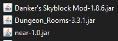
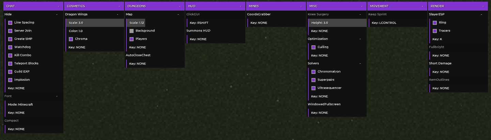

# near (archive)

## Intro
A private 1.8.9 Minecraft Forge mod for Hypixel Skyblock that I used as a "client" for a long time. It's honestly so badly done that It's a miracle it even worked. I decided I wanted to properly redo this and decided to share this because it is no longer used. I made this mod because I did not want to use bloated stuff filled with useless features.

Some of the features here are ripped off from other popular skyblock mods. This mod also became the place of birth of several other projects of mine such as:
- [lilac](https://github.com/DxxxxY/lilac) - Simple config and GUI utility
- [stary](https://github.com/DxxxxY/stary) - Modern and slick Minecraft UI

All the mods I deemed useful are listed below. From my experience, these gave me the complete experience I needed for Hypixel Skyblock and I did not require anything else.

> Note: I did not use Optifine, because for some weird reason, It did more harm than good to my performance (huge garbage collector usage)

## Bugs
A lot of bugs exist in this mod, and I will never fix them. The only critical bug I can think of is the font messing up chat and scoreboard in some weird way that I cannot comprehend.

## Features
> Some features cannot be configured and do not appear in the ClickGUI. If I remember correctly, It has some patches/fixes and some other simple optimization features.

## License
GPLv3 © dxxxxy
